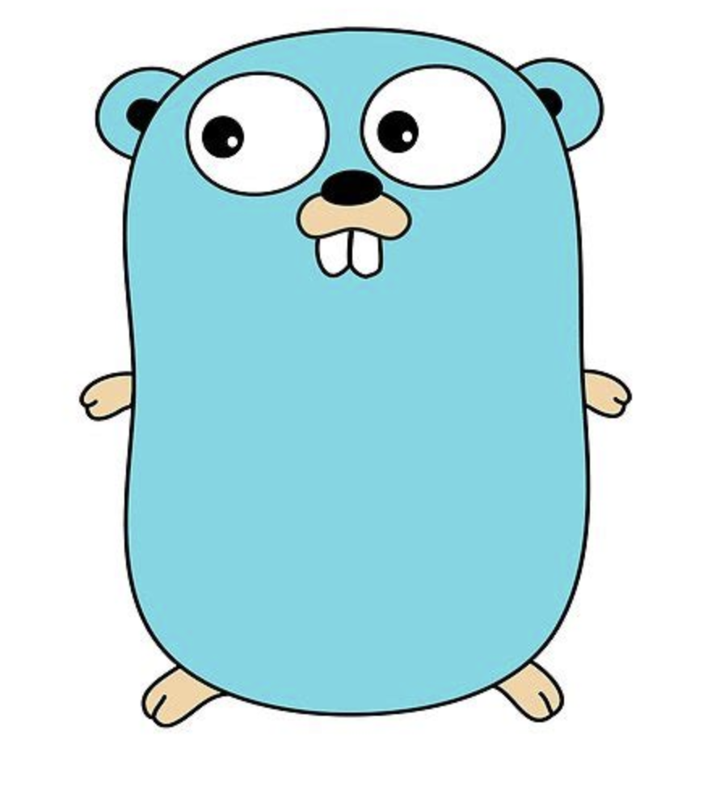

<div align="center">



# chanx

**Every Go channel operation, one function call.**

*Generics · Zero Dependencies · Fluent API*

<br/>

[](https://golang.org/doc/devel/release.html)
[](https://pkg.go.dev/github.com/krigsherre/chanx)
[](LICENSE)

```bash
go get github.com/krigsherre/chanx
```

</div>

---

## Why chanx?

Raw Go channels are powerful — but every common pattern requires dozens of lines of goroutine plumbing. `chanx` wraps those patterns into a single, expressive function call with full type safety via generics.

```
┌─────────────────────────────────────────────────────────────────┐
│                     chanx pipeline model                        │
│                                                                 │
│  stream.Of  ──▶  Filter  ──▶  Map  ──▶  Batch  ──▶  Drain      │
│  [Source]       [Keep]     [Transform] [Group]    [Collect]     │
│                                                                 │
│  Every stage is a typed channel. No goroutine wiring needed.    │
└─────────────────────────────────────────────────────────────────┘
```

---

## Before & After

<table>
<tr>
<th>❌ Raw Go</th>
<th>✅ chanx</th>
</tr>
<tr>
<td>

```go
// Context-aware send
select {
case <-ctx.Done():
    return ctx.Err()
case ch <- val:
}
```

</td>
<td>

```go
// One line
_, err := io.Send(ch, val,
    opt.WithContext(ctx))
```

</td>
</tr>
<tr>
<td>

```go
// Filtered pipeline
// ~30 lines of goroutines,
// channels, and WaitGroups...
```

</td>
<td>

```go
// Fluent & readable
results := stream.Of(1,2,3,4,5,6).
    Filter(isEven).
    Skip(1).
    Take(2).
    Drain() // → [4, 6]
```

</td>
</tr>
</table>

---

## Quick Start

```go
package main

import (
    "fmt"

    "github.com/krigsherre/chanx/stream"
)

func main() {
    // Build a typed pipeline — no goroutine wiring
    pipeline := stream.Of(1, 2, 3, 4, 5).
        Filter(func(i int) bool { return i > 2 }).
        Buffer(10)

    // Map can change the element type
    doubled := stream.Map(pipeline, func(i int) int { return i * 2 })

    fmt.Println(doubled.Drain()) // [6 8 10]
}
```

---

## Integration Examples

Real-world patterns you can drop straight into your project.

### 1 · Worker Pool

Distribute work across N parallel workers and merge their results back into a single stream.

```go
import (
    "fmt"
    "github.com/krigsherre/chanx/stream"
)

func main() {
    // Source: integers 1–9
    jobs := stream.Range(1, 10, 1)

    // Fan out to 3 workers
    workers := stream.FanOut(jobs, 3)

    // Each worker processes its share independently
    processed := make([]<-chan string, 3)
    for i, w := range workers {
        w := w // capture
        processed[i] = stream.Map(w, func(v int) string {
            return fmt.Sprintf("worker-%d processed job %d", i, v)
        })
    }

    // Merge results and collect
    for result := range stream.Merge(processed...) {
        fmt.Println(result)
    }
}
```

---

### 2 · Batched Ingestion

Group a high-volume event stream into fixed-size batches before writing to a database or downstream API.

```go
import (
    "fmt"
    "github.com/krigsherre/chanx/stream"
)

func ingestEvents(events <-chan Event) {
    // Group into batches of 100
    batches := stream.Batch(events, 100)

    for batch := range batches {
        // batch is []Event — write to DB in one round trip
        if err := db.BulkInsert(batch); err != nil {
            log.Println("insert failed:", err)
        }
        fmt.Printf("flushed %d events\n", len(batch))
    }
}
```

---

### 3 · Graceful Shutdown with `OrDone`

Wrap any infinite stream so it stops cleanly when a `done` signal is received — no goroutine leaks.

```go
import (
    "context"
    "github.com/krigsherre/chanx/stream"
)

func process(ctx context.Context, feed <-chan Message) {
    // Convert context cancellation into a done channel
    done := ctx.Done()

    // Infinite feed, but exits when context is cancelled
    safe := stream.Stream[Message](feed).OrDone(done)

    for msg := range safe {
        handle(msg)
    }
    // Reaches here cleanly after ctx.Cancel()
}
```

---

### 4 · Context-Aware Send & Receive

Use the `io` package for any point-to-point channel operation that needs timeout or cancellation semantics.

```go
import (
    "context"
    "time"

    chanxio "github.com/krigsherre/chanx/io"
    "github.com/krigsherre/chanx/opt"
)

func safeSend(ctx context.Context, ch chan<- int, val int) error {
    // Send with context — returns ctx.Err() if cancelled before send
    _, err := chanxio.Send(ch, val, opt.WithContext(ctx))
    return err
}

func safeReceive(ch <-chan int) (int, bool) {
    // Non-blocking receive — returns fallback immediately if channel is empty
    val := chanxio.RecvOr(ch, -1)
    return val, val != -1
}

func timedReceive(ch <-chan int) (int, error) {
    // Receive with a 500 ms deadline
    val, ok, err := chanxio.Receive(ch, opt.WithTimeout(500*time.Millisecond))
    if !ok || err != nil {
        return 0, err
    }
    return val, nil
}
```

---

### 5 · Infinite Generator with Early Stop

`stream.Generate` lets you produce values lazily. `Take` stops the generator after N items — no goroutine leak.

```go
import (
    "fmt"
    "github.com/krigsherre/chanx/stream"
)

func fibonacci() stream.Stream[int] {
    return stream.Generate(func(yield func(int) bool) {
        a, b := 0, 1
        for {
            if !yield(a) {
                return
            }
            a, b = b, a+b
        }
    })
}

func main() {
    first10 := fibonacci().Take(10).Drain()
    fmt.Println(first10) // [0 1 1 2 3 5 8 13 21 34]
}
```

---

## API Reference

The library is split into three focused sub-packages:

### `opt` — Operation Options

Configure any channel operation with composable options:

| Option | Description |
|---|---|
| `opt.WithContext(ctx)` | Attach context cancellation |
| `opt.NonBlocking()` | Return immediately if unable to proceed |
| `opt.WithTimeout(d)` | Set a timeout duration |

---

### `stream` — Fluent Stream Processing

`Stream[T]` is a typed `<-chan T` with method chaining.

**Creation**

| Function | Description |
|---|---|
| `stream.Of(values ...T)` | Create a stream from values |
| `stream.FromSlice(s []T)` | Create a stream from a slice |
| `stream.Generate(fn)` | Yield values from a generator |
| `stream.Range(start, end, step)` | Emit a range of integers |
| `stream.Repeat(values ...T)` | Emit values in a continuous loop |

**Methods**

| Method | Description |
|---|---|
| `.Filter(fn func(T) bool)` | Keep items matching a predicate |
| `.Take(n int)` | Keep only the first `n` items |
| `.Skip(n int)` | Skip the first `n` items |
| `.Buffer(size int)` | Buffer the stream |
| `.Throttle(d time.Duration)` | Emit at most once per interval |
| `.Debounce(d time.Duration)` | Emit only after `d` silence |
| `.OrDone(done <-chan struct{})` | Abort stream when `done` closes |
| `.Drain() []T` | Collect all items into a slice |
| `.ForEach(fn func(T) error)` | Iterate synchronously |

**Transformations & Fan Patterns**

| Function | Description |
|---|---|
| `stream.Map(ch, fn)` | Transform items one-by-one (can change type) |
| `stream.Batch(ch, size)` | Group items into `[]T` batches |
| `stream.FanOut(ch, n)` | Distribute values round-robin to `n` streams |
| `stream.Merge(chs ...)` | Merge multiple channels into one stream |

---

### `io` — Unified Channel I/O

| Function | Description |
|---|---|
| `io.Send(ch, val, opts...)` | Send with optional context / timeout / non-blocking |
| `io.Receive(ch, opts...)` | Receive with optional context / timeout / non-blocking |
| `io.RecvOr(ch, fallback)` | Non-blocking receive with a fallback value |
| `io.NewChan(size)` | Safe channel wrapper — prevents double-close panics |

---

## License

[MIT](LICENSE) © krigsherre
